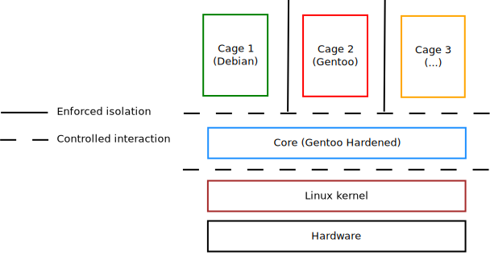
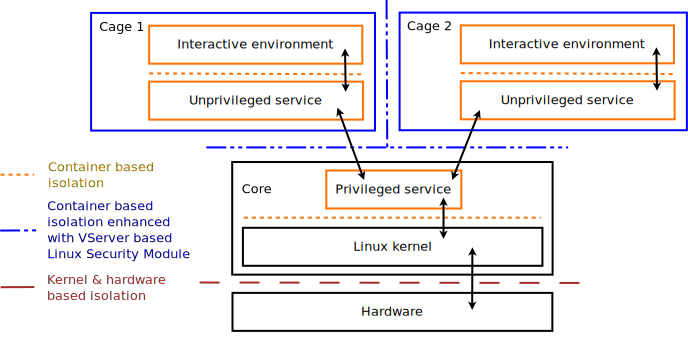

.. Copyright © 2018 ANSSI.
   CLIP OS is a trademark of the French Republic.
   Content licensed under the Open License version 2.0 as published by Etalab
   (French task force for Open Data).

Architecture
============

System components and their interactions
----------------------------------------

A CLIP OS system is split into several logically separated entities:

  * A **bootloader** and an **initial EFI binary** responsible for the system
    start-up.
  * A **Core** responsible for system service hosting and sub environments
    (called *Cages* from now on) start-up. The *Core* is also responsible for
    the isolation and control of all interactions between those *Cages*.
  * One or several **Cages** usually available as graphical sessions for users.
    Each *Cage* may host applications and documents from a specific
    confidentiality level.

.. _clipos-high-level-architecture:

   High level overview of CLIP OS components

The execution environment of each Cage is logically isolated from the Core and
from all the other Cages. Interactions between a Cage and the Core is carefully
controlled and goes through confined and unprivileged services as shown in
:numref:`clipos-cage-and-service-isolation`.

.. _clipos-cage-and-service-isolation:
.. figure:: clipos-cage-and-service-isolation.svg
   :align: center
   :figwidth: 90 %

   Communication channels between a Cage, the Core and the hardware

Direct communication between Cages is forbidden. All inter-Cage interaction is
mediated by services running in the Core.

.. _clipos-inter-level-interactions:

   Flow of interaction required for inter-level communications

.. vim: set tw=79 ts=2 sts=2 sw=2 et:
